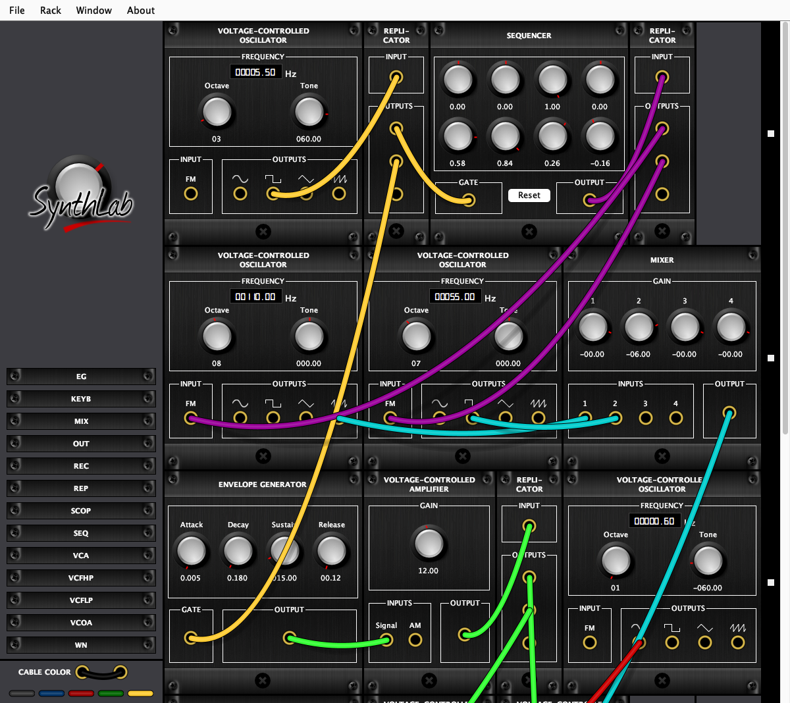

# 🎛️ Synthlab

A modular synthesizer written in Java (Swing + [JSyn](http://www.softsynth.com/jsyn/)).
You drop modules into a rack, patch them together with cables, and turn knobs.
Student project, ISTIC 2013/2014.



## Modules

| Module | What it does |
|---|---|
| VCOA | Oscillator with sine, square, triangle and saw outputs. Octave and fine tune knobs, FM input (1 V = 1 octave) |
| VCFLP / VCFHP | Low-pass (with resonance) and high-pass filters, with a cutoff modulation input |
| VCA | Amplifier with a gain knob and an amplitude modulation input |
| EG | ADSR envelope, triggered by a gate signal |
| SEQ | 8-step sequencer, moves one step on each rising edge of its gate input |
| MIX | 4-input mixer |
| REP | Replicator: copies one signal to three outputs |
| WN | White noise |
| KEYB | Keyboard, plays notes from your computer keyboard |
| SCOP | Oscilloscope |
| REC | Records to a WAV file |
| OUT | Speakers, with a gain knob and a mute button |

## Sample montages

**File → Load** has a **Samples** list with ready-made patches:

- **AcidArp**: an 8-step bass riff through a resonant filter, with a pluck on every note and a slow filter sweep
- **DeepDrone**: three detuned saws slowly beating against each other, with an LFO moving the filter
- **DrumMachine**: a kick (sine with a fast pitch drop) and filtered-noise hi-hats, two clocks one octave apart
- **FMBells**: a pentatonic melody played with FM synthesis, so each note sounds like a bell
- **SpaceSiren**: a slow siren with a fast trill on top
- **Montage1** and **Montage2**: the original examples from 2014

They live in `src/main/resources/montages/`. Patches you save with **File → Save** use the same XML format.

## Play it

### On a Mac

Download [**Synthlab-macOS.zip**](https://github.com/ValentinMumble/synthlab/releases/latest/download/Synthlab-macOS.zip) from the [latest release](https://github.com/ValentinMumble/synthlab/releases/latest), unzip it, and move **Synthlab.app** to your Applications folder. Java is bundled inside, so there is nothing else to install.

The app is not signed. If macOS blocks it the first time, right-click it in Finder and choose **Open**.

### Anywhere with Java 21

```bash
java -jar dist/Synthlab.jar
```

## Build it

### The Mac app

Needs Java 21 and Maven:

```bash
brew install openjdk@21 maven
```

Build `Synthlab.app` (about 75 MB), its zip `target/Synthlab-macOS.zip`, and refresh `dist/Synthlab.jar`:

```bash
./build-mac-app.sh
```

To publish a new version, attach the zip and the jar to a new GitHub release:

```bash
gh release create v1.1.0 target/Synthlab-macOS.zip dist/Synthlab.jar --title "Synthlab 1.1.0"
```

### From the command line

```bash
export JAVA_HOME=/opt/homebrew/opt/openjdk@21
mvn package -DskipTests
$JAVA_HOME/bin/java -jar target/synthlab-0.0.1-SNAPSHOT.jar
```

JSyn is not on Maven Central, so the build reads it from the `repo/` folder in this project.

## Dev tools

Two helpers in `tools/`, compiled against the built jar:

```bash
mkdir -p target/tools
/opt/homebrew/opt/openjdk@21/bin/javac -cp target/synthlab-0.0.1-SNAPSHOT.jar -d target/tools tools/*.java
```

- `RenderMontage` renders a montage to a WAV without the GUI. It also checks the grid layout and every cable. Then `python3 tools/analyse.py out.wav` prints the peak level, any clipping, and loudness over time.

  ```bash
  /opt/homebrew/opt/openjdk@21/bin/java -cp target/synthlab-0.0.1-SNAPSHOT.jar:target/tools RenderMontage src/main/resources/montages/AcidArp.xml out.wav 8
  ```

- `Screenshot` opens the app, loads a sample and saves the window as a PNG (this is how `docs/screenshot.png` was made).

  ```bash
  /opt/homebrew/opt/openjdk@21/bin/java -cp target/synthlab-0.0.1-SNAPSHOT.jar:target/tools Screenshot AcidArp.xml docs/screenshot.png 1200 1100
  ```
